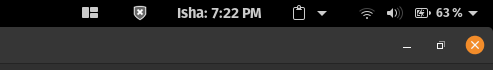

# Gnome Shell Extension
*Author: **Hasir Mushtaq***

Created a Gnome Shell extension to display Namaz Time in any city. 

## Directions for Use

### Step 1: 
In the folder namaz-time@hasir.com/extension.js change the latitude, longitude, and time zone to show results for your city. (Line no. 40):
```javascript
let params = {
        "date": dateToday.toString(),
        // Change to location to display results for your city.
        "latitude": "34.04513309358292",
        "longitude": "74.81649712439841",
        "method": "1",
        "timezone": "Asia/Kolkata",
    };
```

### Step 2:
Move the namaz-time@hasir.com folder to the following folder:
```
./.local/share/gnome-shell/extensions
```

### Step 3:
Install Gnome Tweaks and go to "Extensions" Tab and activate the extension named "Namaz Time extension". Then press:
```
Ctrl + F2
```
and enter:
```
r
```
The extension should appear on top as shown in the screenshot.

## Screenshot
